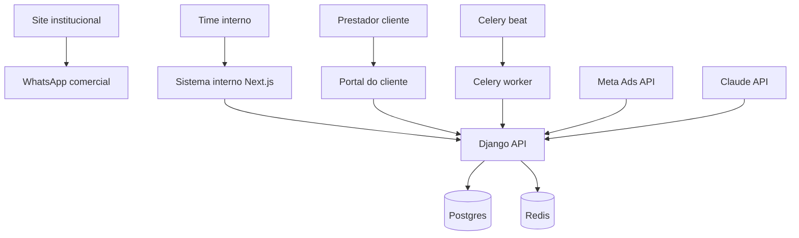

# Contexto do Projeto — MarryMe Boilerplate

Atualizado: Jun/2026  
Domínio institucional: https://marryme.com.br  
Backend produção: https://web-production-62d5c.up.railway.app  
Repositório: https://github.com/Pmauricio593/Marryme-Boilerplate

---

## Identidade da MarryMe

A MarryMe é uma agência de crescimento digital para prestadores de serviços do mercado de casamentos no Brasil.

O posicionamento público atual do site é mais direto e comercial, com foco em músicos de casamento:

> Mais casamentos fechados, mais lucro e uma estratégia feita para transformar músicos em referência.

Esse foco em músicos é o eixo comercial principal do institucional neste momento. A visão operacional já considera expansão para outras categorias, mas isso não deve diluir a copy atual antes do sistema interno estar maduro.

Categorias atendidas ou planejadas:

- Músicos, cantores, bandas e duetos
- Fotógrafos e videomakers
- Celebrantes, padres e officiants
- DJs
- Cerimonialistas e assessoras

Músicos são o nicho de entrada e principal foco de conversão. As demais categorias devem aparecer como expansão natural da metodologia, não como mudança brusca de promessa.

---

## Tom de Marca

A MarryMe deve soar humana, elegante, próxima, confiante e comercialmente objetiva.

Evitar:

- Promessas irreais
- Métricas inventadas
- Clichês de agência genérica
- Linguagem fria de SaaS enterprise
- Termos vazios como "next-gen", "revolucionário", "potencialize"

O padrão de copy deve ser: direto, sofisticado, sem enrolação, com foco em contratos fechados, agenda, previsibilidade, funil e processo comercial.

---

## Estado Real do Repositório

Este repositório é o boilerplate técnico da MarryMe. Hoje ele contém principalmente o backend funcional.

```text
Marryme-Boilerplate/
├── backend/                     # Django + DRF + Celery + Docker
├── frontend/                    # Stubs de assets; app Next.js ainda não criado
├── CURSOR_CONTEXT_MARRYME.md    # Fonte de verdade de produto e operação
├── SKILL_MARRYME.md             # Guia técnico de implementação/design
└── .gitignore
```

### Implementado

- Backend Django com Docker Compose
- Apps principais: `prestadores`, `campanhas`, `roteiros`
- Autenticação JWT por roles
- Portal do prestador em API
- Integração Meta Ads
- Integração Claude para roteiros, análises e geração
- Celery worker e Celery Beat
- PostgreSQL e Redis
- Deploy base no Railway

### Em construção

- Frontend Next.js do sistema interno
- Portal do cliente com interface própria
- UX split-screen para chat de roteiros
- Melhorias de organização, performance e design system

### Fora do foco agora

Prospecção automatizada e Apify não são prioridade nesta fase. Não construir app de prospecção, endpoints de scraping ou fluxos de enriquecimento até que CS e sistema interno estejam sólidos.

---

## Prioridade Operacional

A prioridade do sistema é apoiar o time interno, especialmente CS.

Ordem de foco:

1. CS: gestão de prestadores, pipeline, campanhas, health score e pautas de reunião
2. Conteúdo: roteiros, análises e materiais gerados por IA
3. Portal do cliente: leitura clara de desempenho e materiais aprovados
4. Vendas/onboarding: entrada organizada de novos clientes
5. Prospecção: somente depois que as funções primárias estiverem maduras

---

## Arquitetura Alvo

```text
marryme.com.br
└── Site institucional
    Público: prestadores interessados
    Status: layout preservado; copy ajustável

marryme.com.br/app
└── Sistema interno + portal
    Equipe: dashboard, CS, campanhas, roteiros
    Cliente: portal próprio, campanhas, roteiros, health score
    Status: Next.js ainda não criado

Backend Django — Railway
└── API REST
    Auth JWT, Postgres, Redis, Celery, integrações
    Status: funcional
```



---

## Stack Técnica

### Backend

- Django 6
- Django REST Framework
- SimpleJWT
- PostgreSQL
- Redis
- Celery + django-celery-beat + django-celery-results
- Docker Compose local
- Railway em produção
- Integrações prioritárias: Meta Ads API e Anthropic Claude

Padrão de código:

```text
View/API -> Service -> Integration -> Model -> Task
```

### Frontend do sistema

Ainda não implementado. Quando for criado:

- Next.js App Router
- TypeScript
- Tailwind CSS
- Sonner para feedbacks
- React Hook Form + Zod quando houver formulários
- Cliente API centralizado
- Autenticação JWT com refresh
- Rotas separadas para equipe e portal

### Site institucional

O layout atual não será refeito agora. A documentação de site estático permanece como direção possível para fase futura, mas não deve ser tratada como implementada no repositório atual.

---

## Apps Django Existentes

### `apps.prestadores`

Responsabilidade: base de clientes/prestadores, usuários, portal e pipeline.

Funções primárias:

- Cadastro e edição de prestadores
- Pipeline de fases
- Usuário interno e usuário prestador
- Primeiro acesso do portal
- Login do portal
- Perfil do prestador
- Dados do prestador para portal

Prioridade para CS:

- Visão clara de fase
- Responsável pelo cliente
- Status e dados essenciais
- Acesso rápido a campanhas, roteiros e histórico

### `apps.campanhas`

Responsabilidade: Meta Ads, métricas, relatórios e Health Score.

Funções primárias:

- Sincronizar dados Meta Ads
- Armazenar métricas de campanha
- Calcular Health Score
- Gerar relatório IA
- Apoiar pauta de reunião de CS

Health Score deve ser tratado como métrica operacional de CS. A fórmula precisa permanecer alinhada entre código, documentação e comunicação do portal.

### `apps.roteiros`

Responsabilidade: geração e gestão de roteiros.

Funções primárias:

- Sessões de chat por prestador
- Mensagens e histórico
- Geração de roteiro com Claude
- Streaming de resposta
- Roteiros finais
- Aprovação para uso como referência futura

Prioridade:

- Fluxo de trabalho rápido para a equipe
- Histórico rastreável
- Saída pronta para WhatsApp, anúncio e proposta
- Portal do cliente como camada posterior

---

## Endpoints Principais

Base local: `http://localhost:8000`  
Base produção: `https://web-production-62d5c.up.railway.app`

### Saúde

```text
GET /
GET /health/
```

### Auth equipe

```text
POST /api/v1/auth/login/
POST /api/v1/auth/refresh/
```

### Prestadores

```text
GET    /api/v1/prestadores/
POST   /api/v1/prestadores/
GET    /api/v1/prestadores/{id}/
PUT    /api/v1/prestadores/{id}/
DELETE /api/v1/prestadores/{id}/
POST   /api/v1/prestadores/{id}/atualizar-fase/
POST   /api/v1/prestadores/{id}/sync-meta/
POST   /api/v1/prestadores/sync-todos/
```

### Campanhas e CS

```text
GET  /api/v1/metricas/
GET  /api/v1/health-scores/
GET  /api/v1/health-scores/ultimo/
GET  /api/v1/relatorios/
POST /api/v1/relatorios/
POST /api/v1/relatorios/{id}/gerar-analise/
```

### Roteiros

```text
GET  /api/v1/sessoes/
POST /api/v1/sessoes/
POST /api/v1/sessoes/{id}/mensagem/
POST /api/v1/sessoes/{id}/stream/
POST /api/v1/sessoes/{id}/arquivar/
POST /api/v1/sessoes/{id}/finalizar/
GET  /api/v1/mensagens/
GET  /api/v1/roteiros-finais/
POST /api/v1/roteiros-finais/{id}/aprovar/
```

### Portal

```text
POST /api/v1/portal/auth/login/
POST /api/v1/portal/auth/primeiro-acesso/
GET  /api/v1/portal/perfil/
GET  /api/v1/portal/campanhas/
GET  /api/v1/portal/roteiros/
```

---

## Roles e Permissões

Intenção de produto:

```text
admin     -> acesso total
dev       -> acesso técnico total
cs        -> gestão operacional de clientes
sdr       -> criação/leitura focada em vendas
prestador -> apenas próprios dados no portal
```

Ao implementar frontend e permissões, validar a hierarquia real no código antes de assumir qualquer comportamento.

---

## Variáveis de Ambiente

Nunca hardcodar segredos no código.

### Local Docker

```env
SECRET_KEY=
DEBUG=True
ALLOWED_HOSTS=localhost,127.0.0.1
DATABASE_URL=postgres://marryme:marryme@db:5432/marryme
REDIS_URL=redis://redis:6379/0
FRONTEND_URL=http://localhost:3000
PORT=8000
```

### Integrações prioritárias

```env
ANTHROPIC_API_KEY=
CLAUDE_MODEL=claude-sonnet-4-6
META_ACCESS_TOKEN=
META_APP_ID=856861430279251
META_APP_SECRET=
```

`APIFY_API_TOKEN` pode existir no `.env.example`, mas não é foco agora.

---

## Diretriz para o Site Institucional

O site atual deve continuar com foco em conversão para músicos enquanto a operação multi-categoria amadurece.

### Manter

- Oferta direta: agenda, contratos, lucro e funil
- Linguagem comercial prática
- Ênfase em WhatsApp, criativos, comercial e campanhas
- Cases e depoimentos reais
- Estrutura atual de layout

### Ajustar na copy

- Deixar claro que a MarryMe não vende apenas tráfego, mas processo comercial completo
- Reforçar acompanhamento e rotina de dados
- Introduzir Health Score e portal como diferenciais, sem prometer o que ainda não estiver em produção
- Evitar linguagem genérica de marketing

### Não fazer agora

- Redesenhar layout
- Criar nova arquitetura visual
- Expandir a home inteira para todas as categorias de uma vez
- Inventar números, cases ou depoimentos

---

## Diretriz para o Sistema Interno

O sistema deve ser construído primeiro para eficiência do time.

Princípios:

- CS abre o dashboard e entende rapidamente quais clientes precisam de atenção
- Todo prestador deve ter histórico, fase, métricas e materiais acessíveis
- Relatórios devem virar pauta de reunião, não apenas gráficos
- Roteiros devem ser gerados em fluxo conversacional com histórico
- Portal do cliente deve ser consequência da organização interna

Prioridade de telas:

1. Login equipe
2. Dashboard de prestadores
3. Detalhe do prestador
4. Campanhas e Health Score
5. Roteiros/chat
6. Portal do prestador

---

## Padrões de Implementação

### Backend

- Configuração por env vars
- Services para regra de negócio
- Integrations para APIs externas
- Tasks para trabalho assíncrono
- Views finas
- Logs em stdout
- Sem salvar estado crítico em disco local
- Sem API keys no frontend

### Frontend

- Componentes por domínio, não por moda visual
- Cliente API centralizado
- Tipos TypeScript alinhados aos serializers
- Estados de loading, erro e vazio em toda tela operacional
- Toast com Sonner, nunca `alert()`
- Performance desde o início: lazy loading, cache e renderização simples

### Documentação

- Docs devem diferenciar estado atual de visão futura
- Não criar arquivos `.md` novos sem necessidade
- Atualizar este arquivo quando mudar arquitetura, endpoint ou prioridade

---

## Modus Operandi do Time

Antes de implementar:

1. Diagnosticar o estado real do código
2. Conferir se a mudança pertence ao backend, sistema interno, portal ou institucional
3. Checar impacto em CS
4. Definir se é requisito atual ou visão futura
5. Evitar refatorações amplas sem ganho operacional claro

Ao implementar:

- Preferir padrões locais do projeto
- Manter mudanças pequenas e rastreáveis
- Não expor secrets
- Não criar documentação extra sem necessidade
- Não priorizar prospecção enquanto CS/sistema interno não estiverem sólidos

Ao revisar:

- Confirmar se a mudança ajuda o time a operar melhor
- Confirmar se o portal continua restrito ao prestador correto
- Confirmar se dados sensíveis não vazam
- Confirmar se performance e clareza não foram sacrificadas

---

## Roadmap por Frente

### CS — prioridade

- Dashboard de prestadores
- Filtros por fase, categoria e responsável
- Detalhe com campanhas, health score e roteiros
- Relatório IA como pauta de reunião
- Alertas de clientes em atenção/risco

### Roteiros

- Chat por prestador
- Histórico por sessão
- Streaming da resposta IA
- Aprovação de roteiro final
- Uso de roteiros aprovados como referência

### Portal do cliente

- Login do prestador
- Perfil
- Campanhas
- Health Score
- Roteiros aprovados

### Institucional

- Ajustes de copy
- Preservação do layout atual
- Melhor clareza de oferta
- CTA para WhatsApp

### Prospecção

Não priorizar nesta etapa.

